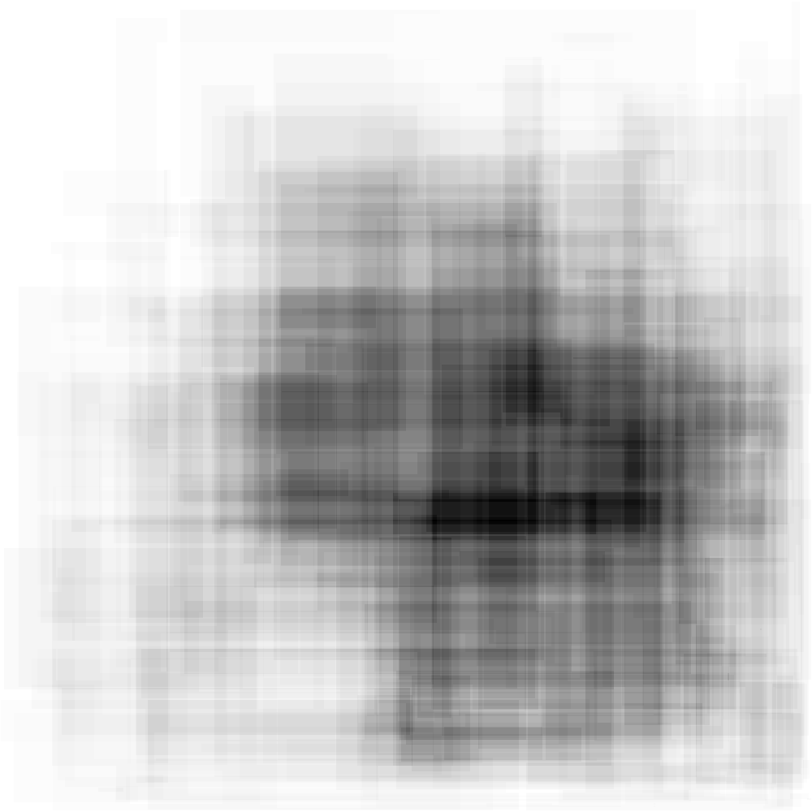

## Visualizing the **_Million Lights_**

To satisfy my curiosity about what was that Santa wanted us to display, I've decided to use
[matplotlib][1] to draw the images.

Here, you can see the results for my input. It seems that Santa _loves_ abstract art.

[1]: https://matplotlib.org/
