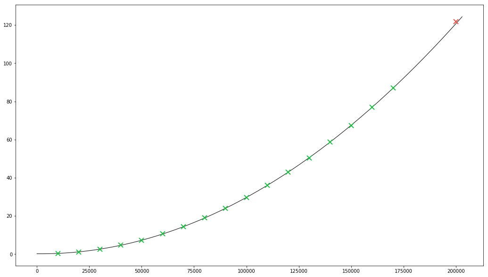

## Optimizing the Von Neumann simulation

Running with: i7 7700k@4,5GHz

I've begun with estimating the memory requirement of the naive implementation:

| Structure                                 |          size |   s/1024/1024 |
|:------------------------------------------|--------------:|--------------:|
| Empty list                                |          64 B |             - |
| 1 int                                     |           8 B |             - |
| 50 000 001 ints + list                    |   400000072 B |     381.46 MB |
| List of 50 000 001 ints + list overhead   |   424076264 B | **404.43 MB** |

The entire number list would need a little bit over **400 MB**, so it's not a big deal.

Time requirement however, is insanely long - the extrapolated time requirement was **over 60 days**.

To extrapolate, I've generated first `200 000` states, measuring time elapsed between every `10 000`
generated states using:

```
start_time = time.time()

    ...
    if i % 10000 == 0:
        print(i, time.time() - start_time)
    ...
```

Doing that I've acquired some data points for the extrapolation:

|    States |  Elapsed time |
|----------:|--------------:|
|     10000 |   0.2717514 s |
|     20000 |   1.1400308 s |
|     30000 |   2.6085634 s |
|     40000 |   4.6817502 s |
|     50000 |   7.3493192 s |
|     60000 |  10.6131870 s |
|     70000 |  14.4811995 s |
|     80000 |  18.9508862 s |
|     90000 |  24.0068151 s |
|    100000 |  29.7068729 s |
|    110000 |  35.9707674 s |
|    120000 |  42.8768818 s |
|    130000 |  50.3933198 s |
|    140000 |  58.5908844 s |
|    150000 |  67.4257111 s |
|    160000 |  76.9266819 s |
|    170000 |  87.0808138 s |
|  *200000* |*121.8512763 s*|

I've solved a **second order polynomial regression function** over 17 data points (20th point was
for cross-validation of formula):

```
y = 3.071247227 * 10^(-9) * x^2 - 1.210640658 * 10^(-5) * x + 1.988593495 * 10^(-1)
```

I've implemented the function in Python and calculated the 20th data point for cross-validation:

```
>>> def y(x):
...     return 3.071247227 * 10**(-9) * x**2 - 1.210640658 * 10**(-5) * x + 1.988593495 * 10**(-1)
...
>>> y(200000)
120.6274671135
```

It's fairly close, off by **1.2238 s** from the real value, so my extrapolation function is
*underestimating* by about **1.0145%**. Good enough for me.



<sup>[Code for plotting the extrapolation chart][1]</sup>

Now to calculate the time for entire length of the input:

```
>>> y(50000001)
7677513.25314297
```

...which yields **7677513.25 seconds**, in sane units: **88 days 20 hours 38 minutes 33 seconds**.

Running it for a few months was obviously out of question.

---

Acorrding to the puzzle description, the program should "*insert the new value, **after** the value
it stopped on*", so it we can deduce that it will never put a new value on the `0th` index,
and so the value `0` will stay there indefinitely.

We'll test that by modyfing solution of Part 1...

```
    ...
        if i <= 20:
            print(i, numbers)
    ...
```

...and taking a look at first 20 states:

```
1 [0, 1]
2 [0, 2, 1]
3 [0, 2, 3, 1]
4 [0, 2, 4, 3, 1]
5 [0, 5, 2, 4, 3, 1]
6 [0, 5, 2, 4, 3, 6, 1]
7 [0, 5, 2, 4, 3, 7, 6, 1]
8 [0, 8, 5, 2, 4, 3, 7, 6, 1]
9 [0, 8, 5, 2, 4, 9, 3, 7, 6, 1]
10 [0, 8, 5, 2, 4, 9, 3, 7, 6, 10, 1]
11 [0, 8, 5, 2, 4, 9, 3, 7, 6, 10, 11, 1]
12 [0, 8, 12, 5, 2, 4, 9, 3, 7, 6, 10, 11, 1]
13 [0, 8, 13, 12, 5, 2, 4, 9, 3, 7, 6, 10, 11, 1]
14 [0, 8, 14, 13, 12, 5, 2, 4, 9, 3, 7, 6, 10, 11, 1]
15 [0, 8, 14, 13, 12, 5, 15, 2, 4, 9, 3, 7, 6, 10, 11, 1]
16 [0, 8, 16, 14, 13, 12, 5, 15, 2, 4, 9, 3, 7, 6, 10, 11, 1]
17 [0, 8, 16, 14, 13, 12, 5, 15, 2, 17, 4, 9, 3, 7, 6, 10, 11, 1]
18 [0, 8, 16, 14, 13, 12, 5, 15, 2, 17, 4, 9, 3, 18, 7, 6, 10, 11, 1]
19 [0, 8, 16, 14, 13, 12, 5, 15, 2, 17, 4, 9, 3, 18, 7, 6, 19, 10, 11, 1]
20 [0, 8, 16, 14, 13, 12, 5, 15, 2, 17, 4, 9, 3, 18, 7, 6, 19, 10, 11, 1, 20]
```

Indeed that seems to be the case. Now that we know that, we can completely omit construction of
the number list, as well as inserting consecutive values at their respective position, and just
keep track of the values that are inserted at the `1st` position.

Now the solution runs in **4.88938 s**, about **1 570 243 times** faster! Now that's what I call a
successful optimization!

[1]: extrapolation.py
